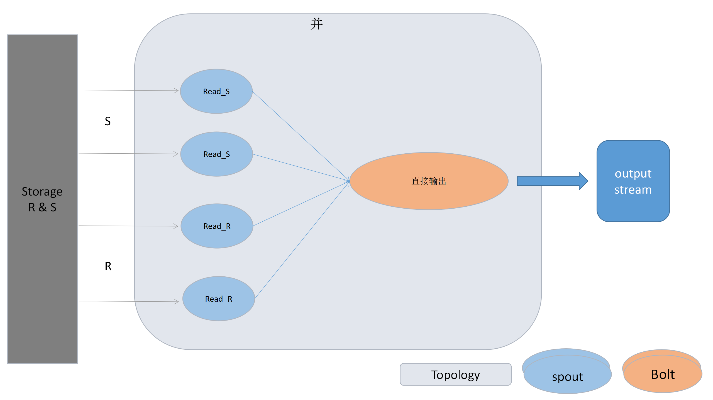

# Distributed Operator

## Assumption

### Single Node

- 磁盘IO开销远大于内存计算 
- 尽可能减少磁盘IO

### Distributed Environment

- 网络开销 和 磁盘IO 都是性能的考量因素 
  - 在读取和写入的情况下，网络开销可以和写入开销放在一起。
- 尽可能减小网络开销，计算逻辑尽可能下放到存储节点（存算不分离）。

## 流式与mini-batch计算框架

### Storm

docker 部署，组件包含zookeeper，storm。目前有一个zookeeper节点，一个storm nimbus（主:some-nimbus）节点，一个 storm  supervisor（从）节点，一个storm ui节点。


#### 向集群提交topology

```bash
docker run --link some-nimbus:nimbus -it --rm -v $(pwd)/topology.jar:/topology.jar storm storm jar /topology.jar org.apache.storm.starter.WordCountTopology topology
```

- 向主节点some-nimbus提交topology（jar包）并执行

### Spark

### MapReduce


## 存储方案调研

### 使用KV单节点

#### levelDB / RocksDB


## 算子方案实现

方案划分按照关系的大小来进行，针对于不同的情况选取不同的方案和框架来做。

### 与内存大小无关，天然支持流式处理的算子

投影&选择&并

### 关系较小，可以基于内存的方案 ：使用框架 storm

- 对于双目算子而言：若其中较小的关系可以被完全的用内存兜住，那么也在完成最初的hash之后，也能够支持流式输出。
- 排序算子：使用storm框架模拟多路归并
- 集合&聚集 && 并&差&自然连接： 由于可以直接使用storm进行模拟，所以多路归并似乎不需要。

**基于storm的问题**：

- 

单目算子

| 单目算子 | 单机方案                                      | 分布式方案                                                   | 流式支持                                    | 复杂度分析 |
| -------- | --------------------------------------------- | ------------------------------------------------------------ | ------------------------------------------- | ---------- |
| 选择     | 一趟算法，读取多个Batch进入内存，然后进行处理 | **Storm**: 多个Spout读取数据，通过ShuffleGrouping的方式随机分配给多个Bolt消费，流式输出结果。 | 支持                                        |            |
| 投影     | 一趟算法，读取多个Batch进入内存，然后进行处理 | **Storm**: 多个Spout读取数据，通过ShuffleGrouping的方式随机分配给多个Bolt消费，流式输出结果。 | 支持                                        |            |
| 排序     |                                               | **Storm**：多个Spout读取数据，通过通过fieldsGrouping的方式按field将具有相同的值的tuple发送给同一个bolt, 单个bolt内部进行排序。这一阶段完成后，最后由一个汇总的bolt进行总的排序，类似于多路归并的第二阶段，通过**Tuple#getSourceComponent**获取源bolt. | 流式？                                      |            |
| 集合     |                                               | **Storm**: 多个Spout 读取数据，通过fieldsGrouping的方式按field将具有相同的值的tuple发送给同一个bolt, 单个bolt内部，若内存中无此项，则输出，若内存中有，则什么也不做。 | 支持                                        |            |
| 聚合     |                                               | **Storm**: 多个spout读取数据，通过fieldsGrouping的方式按field将具有相同的值的tuple发送给同一个bolt, 单个bolt内部进行聚合操作,在cleanup阶段输出。**不同的聚合函数在后续处理时有细微的差别。** | 可以使用Storm实现，**但是整体逻辑是批处理** |            |


#### 双目算子

| 双目算子 | 单机方案 | 分布式方案                                                   | 流式支持 | 复杂度分析 |
| -------- | -------- | ------------------------------------------------------------ | -------- | ---------- |
| 自然连接 |          | **Storm**：  多个spout读取关系S，并用fieldGrouping的方式发往bolt进行hash存储，完成后发往下一阶段的bolt，下一段的bolt接受多个stream，并进行匹配计算，匹配成功则进行连接并输出。 | 支持？   |            |
| 交       |          | **storm**：多个spout读取关系S，并用fieldGrouping的方式发往bolt进行hash存储，完成后发往下一阶段的bolt，下一段的bolt接受多个stream，进行s的分片与R全表匹配,匹配成功后输出并hash表计数减一，直至0。 |          |            |
| 并       |          | **storm**：多个spout直接读取关系R和S，用shuffleGrouping随机分配给多个bolt，直接输出 |          |            |
| 差       |          | **storm**：多个spout读取关系S，并用fieldGrouping的方式发往bolt进行hash存储，完成后发往下一阶段的bolt，下一段的bolt接受多个stream，进行s的分片与R全表匹配.匹配成功计数器-1，不成功或者计数器为0时，输出元组。 |          |            |





### 关系很大 无法全部装入内存

#### 多路归并分布式化

- 排序：在表真的很大但是内存真的很受限制的情况下，需要进行多次迭代来进行操作。但是这样效率会非常低，

#### 索引

### 一些问题的集合

##### 假设可用的内存为16GB，但关系的大小为20G。在这种情况下，完全应用关系很大的情况下的方案是否不合适，是否也可以部分利用流式处理框架？

